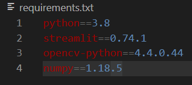
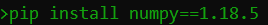
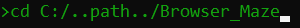
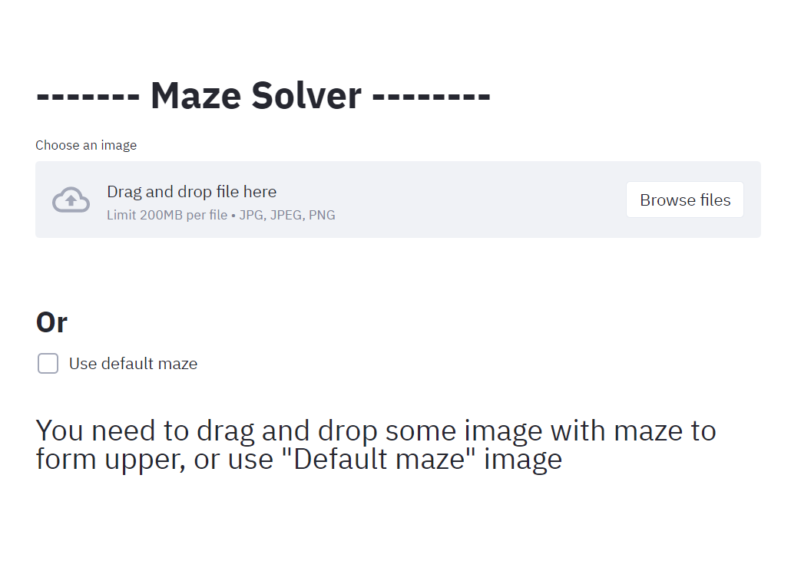
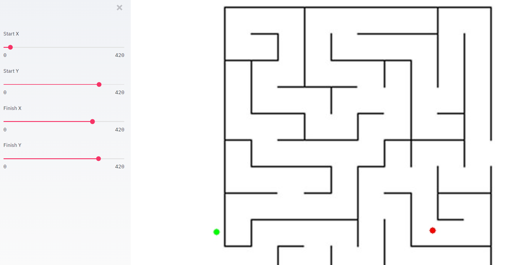
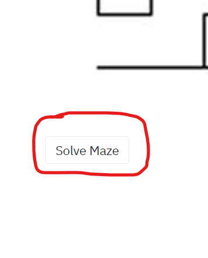
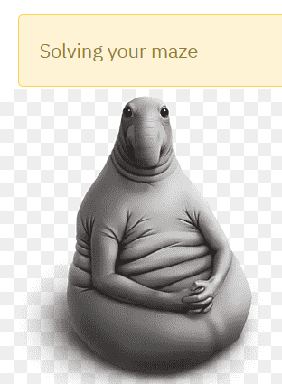
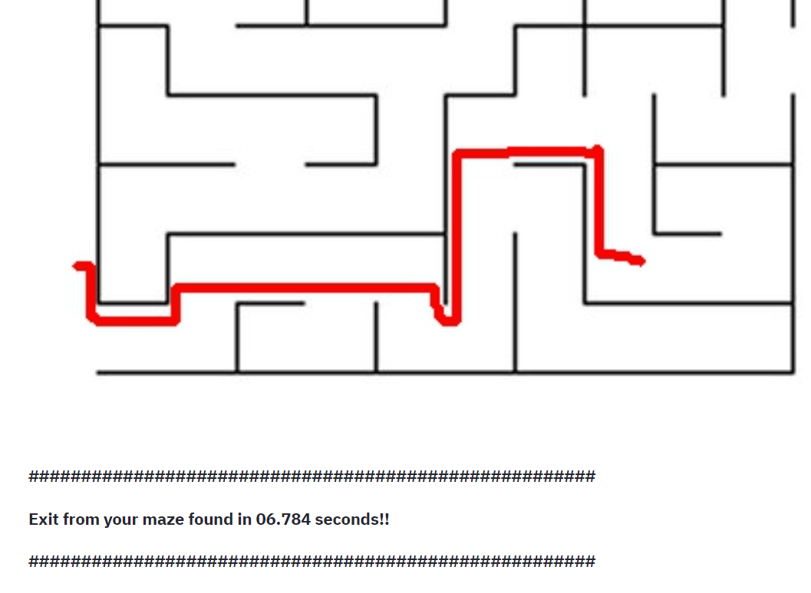
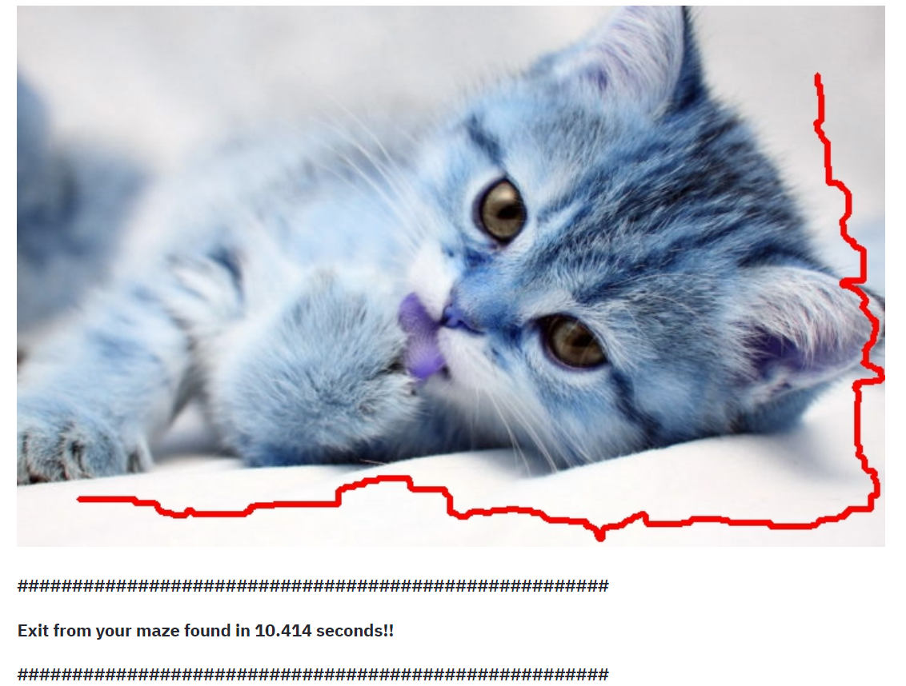
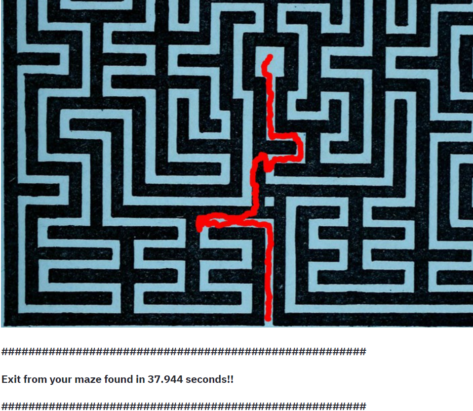

# Maze Solver

## How to use this project?:
1. Download the **repository**
2. Check the **requirements.txt**

3. Install the missing packages(***If there are none***)

4. Run the cmd and run these commands: 
    * cd (path to "Browser_Maze" repository)
    
    * streamlit run main.py(Your default browser will 
    open a localhost page on port 8501 with our project)
    
    * Done! The project is up and running(I used **Opera** browser)
    

5. Follow the on-screen instructions
6. After selecting an image(your own or the default image), the window for setting the **Start** and **End** points of the maze will open.Use the sliders to adjust the position of the **points**

7. After setting up, click on the button under the picture.The search for a way out of the maze will begin.

8. We wait a little.The waiting time depends on the complexity of the maze

9. Done! We got an image with the solution. Below you can see the execution time of the algorithm

# **Recommendations**
1. Mazes should be two-colored(for example, black walls and white paths)
2. It is advisable to use pictures with mazes, the algorithm works strangely in pictures with cats))

3. If you use a **fairly large picture with high resolution** you can lose a 2-3 years of life or your computer will turn into a good toaster(~~The solution is also not always correct~~)

## **Well, it seems to be all.If you liked the project, don't forget to rate it.**

